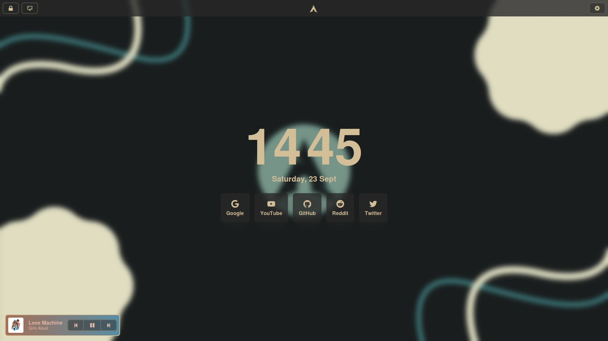

# Epic Start Page



## Features

- **Media Control** - Control your currently playing media from the start page.
- **Lock Screen** - Lock your computer with a click.
- **Screenshot** - Take a screenshot of your desktop.
- **Quick Links** - Quickly open a website of your choice.

## Installation

```bash
# Clone the repository
git clone https://github.com/BeauTheBeau/start-page.git
cd start-page

# Install dependencies
npm install

# Run the backend
npm run start
```

## Dependencies


### Absolutely Required
- [**Node.js**](https://nodejs.org/en/)
- [**npm**](https://www.npmjs.com/)
- [**Electron**](https://www.electronjs.org/)


- [**cURL**](https://curl.se/) - For retrieving album art
- **base64** - For encoding album art


### 
- [**Playerctl**](https://github.com/altdesktop/playerctl) - For media control and retrieving metadata
- [**Grimblast**](https://github.com/hyprwm/contrib/tree/main/grimblast) - For screenshots (`Print`)
- [**Swaylock**](https://github.com/swaywm/swaylock) - Screen locker

